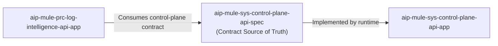
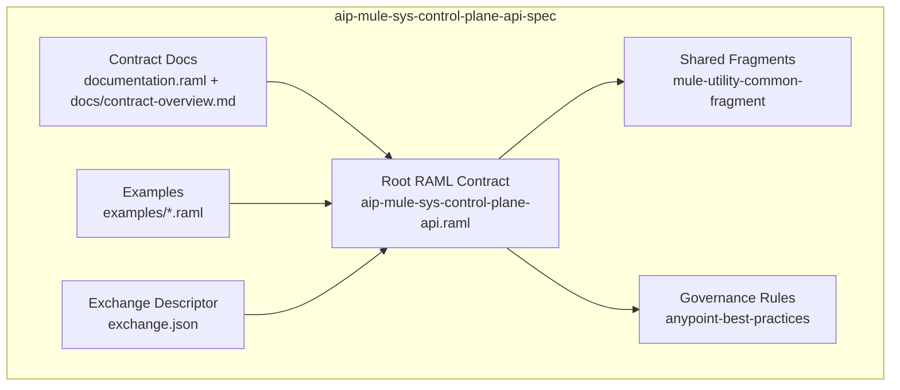
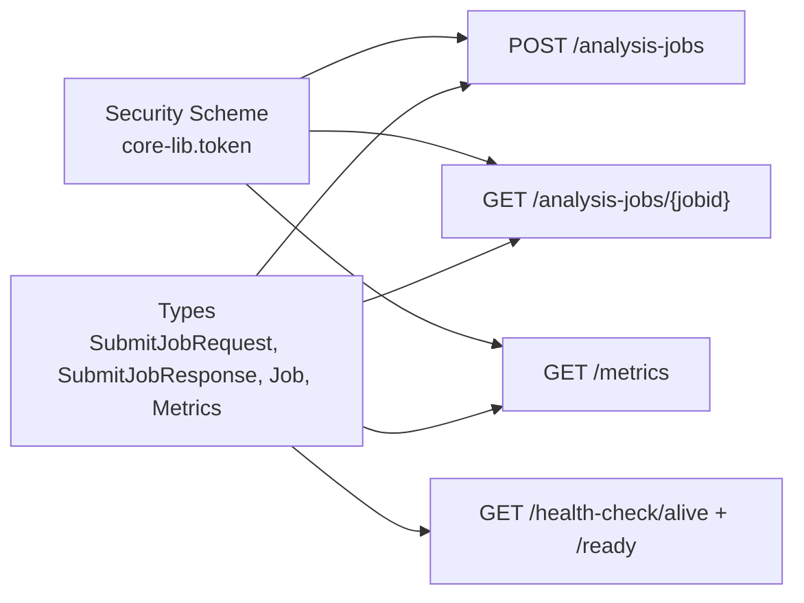

# C4 Model Diagrams - AIP System Control Plane API Specification

## Purpose

Provide a contract-centred architecture view for this System API specification, focusing on job lifecycle behaviour and control-plane interoperability.

## C4 Level 1 - Contract Context

## C4 Level 2 - Contract Containers

## C4 Level 3 - Contract Components

## Update Triggers

Update these diagrams whenever lifecycle semantics, payload models, security controls, or MCP binding-related operation naming changes.
